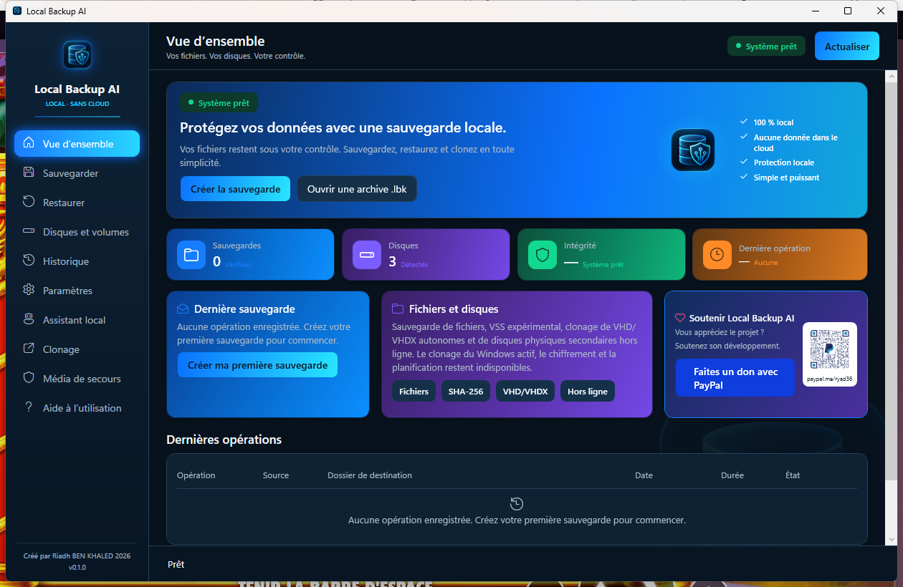
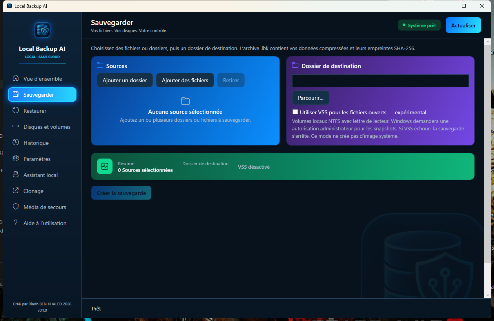
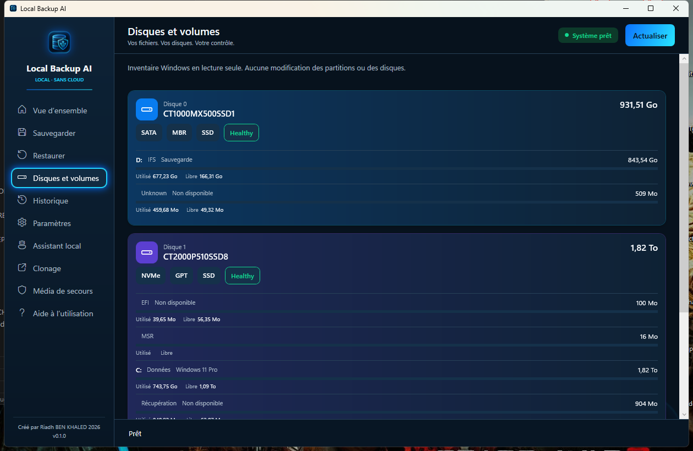
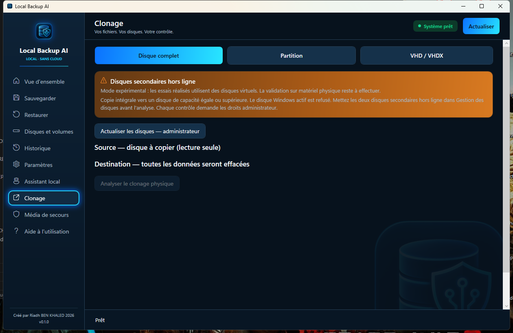
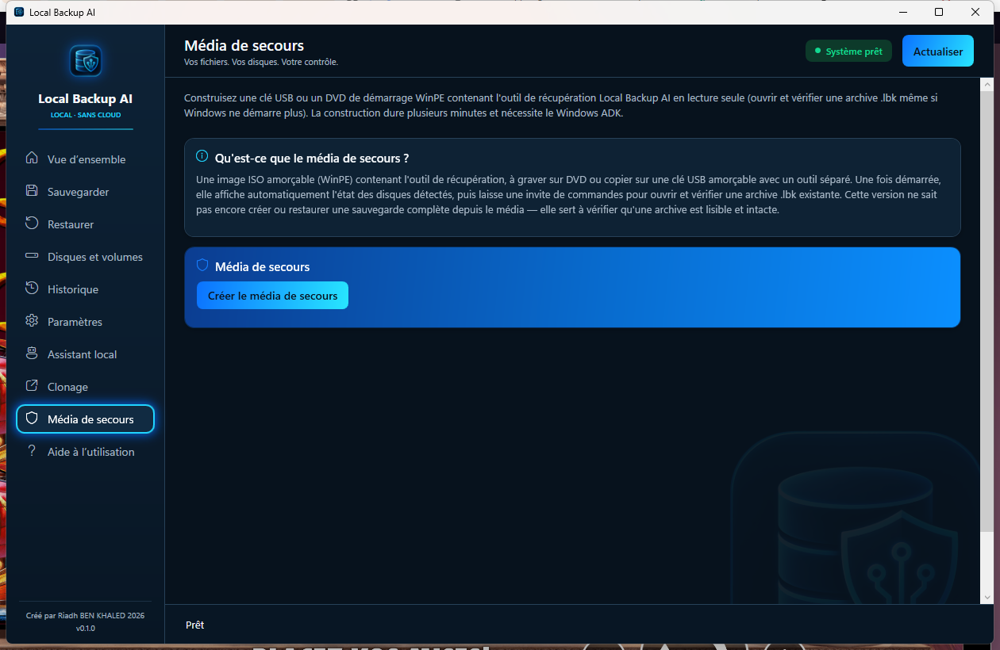

# Local Backup AI

**Sauvegardez et restaurez vos fichiers sous Windows, sans cloud et sans compte.**

[Télécharger pour Windows x64](https://github.com/Riadh35/local-backup-ai/releases/latest/download/LocalBackupAI-Setup.msi) · [English](README.md) · [Résultats des tests](VALIDATION.md) · [Signaler un problème](https://github.com/Riadh35/local-backup-ai/issues)

L'interface est **en français**. La documentation est bilingue ; l'interface anglaise n'est pas incluse dans la v0.1.0. L'assistant IA est facultatif : sauvegarder et restaurer ne nécessite pas Ollama.

Ce dépôt distribue l'installeur compilé et la documentation. **Le code source de l'application n'est pas publié.**

<p align="center"></p>

## Premier essai

1. Ouvrez la [dernière version](https://github.com/Riadh35/local-backup-ai/releases/latest) et téléchargez **LocalBackupAI-Setup.msi** dans Assets. Le ZIP « Source code » généré par GitHub n'est pas l'application.
2. Installez-le sous Windows 10/11, 64 bits. Le MSI **n'est pas signé numériquement** : Windows peut afficher un avertissement d'éditeur inconnu ou de réputation. Respectez les règles de sécurité de votre organisation.
3. Dans **Sauvegarder**, ajoutez un petit dossier de démonstration, choisissez une destination hors de ce dossier et cliquez sur **Créer la sauvegarde**.
4. Dans **Restaurer**, ouvrez le dossier `.lbk` obtenu et cliquez sur **Vérifier l'intégrité**.
5. Restaurez vers un nouveau dossier et comparez les fichiers obtenus aux originaux avant de confier des données importantes à l'application.

Conservez les sauvegardes sur un support physiquement distinct. Copiez le **dossier `.lbk` entier**, pas uniquement son manifeste. Voir [le format et la récupération des archives](ARCHIVE_FORMAT.md).

## Fonctions et limites

| Fonction | Périmètre |
|---|---|
| Sauvegarde | Dossier `.lbk`, manifeste versionné, blocs Zstandard, empreintes SHA-256 |
| Restauration | Tous les fichiers ou un fichier sélectionné, nouveau dossier sans écrasement |
| Vérification | Relecture des données et comparaison des empreintes |
| Disques et volumes | Inventaire Windows en lecture seule |
| Copie VHD/VHDX | Conteneur autonome, hors ligne, non monté, copié vers un nouveau fichier puis vérifié |
| VSS | Expérimental ; fichiers ouverts via snapshot, élévation requise, arrêt si le snapshot échoue |
| Clonage disque / partition | Expérimental ; efface la destination, disques secondaires hors ligne, confirmation explicite |
| Média WinPE | Construction d'une ISO amorçable avec Windows ADK + add-on WinPE ; pas d'écriture directe d'une clé USB |
| Assistant | Aide facultative via Ollama ; ne peut lancer aucune opération sur les données |

Cette version ne réalise pas d'image ni de migration du Windows actif. Elle n'offre pas de planification ni de chiffrement. La conservation des permissions NTFS, flux alternatifs et liens n'est pas garantie. Une empreinte SHA-256 n'est ni un chiffrement ni une preuve d'authenticité.

Le [rapport de validation](VALIDATION.md) distingue les opérations réelles des intégrations simulées. Évaluez les fonctions expérimentales sur des données jetables.

## Aperçu

<p align="center">
  
  
</p>
<p align="center">
  
  
</p>

## Prérequis et confidentialité

- Windows 10/11 x64. Les environnements effectivement testés figurent dans le rapport.
- Autorisation administrateur pour l'installation et les fonctions nécessitant des accès élevés, dont VSS et le clonage physique.
- Windows ADK + add-on WinPE uniquement pour construire le média de secours.
- [Ollama](https://ollama.com) et un modèle téléchargé uniquement pour l'assistant facultatif.

Sauvegarde, vérification, restauration et clonage s'exécutent localement. L'assistant communique avec Ollama local. L'installation des outils facultatifs et le téléchargement d'un modèle nécessitent Internet ; ouvrir un lien externe utilise le service concerné séparément.

## Intégrité de l'installeur

Pour la **v0.1.0**, `LocalBackupAI-Setup.msi` fait 66 519 559 octets. SHA-256 :

```text
518ddb827f02a87c1117c3f280d7f2d2ec5589ef98bc3065adb730c1d5f5ce7c
```

Vérifiez-le avec `Get-FileHash .\LocalBackupAI-Setup.msi -Algorithm SHA256`. Une empreinte identique confirme la correspondance avec cette version ; elle ne remplace pas une signature numérique ou un audit de sécurité.

## Retours et soutien

[Ouvrez un ticket](https://github.com/Riadh35/local-backup-ai/issues) avec vos versions de Windows et de l'application, les étapes de reproduction et le message d'erreur. Retirez les chemins personnels et données sensibles des journaux et captures. Les retours en français et en anglais sont bienvenus.

Créé par **Riadh BEN KHALED**. [Soutenir le développement](https://paypal.me/ryad36).
