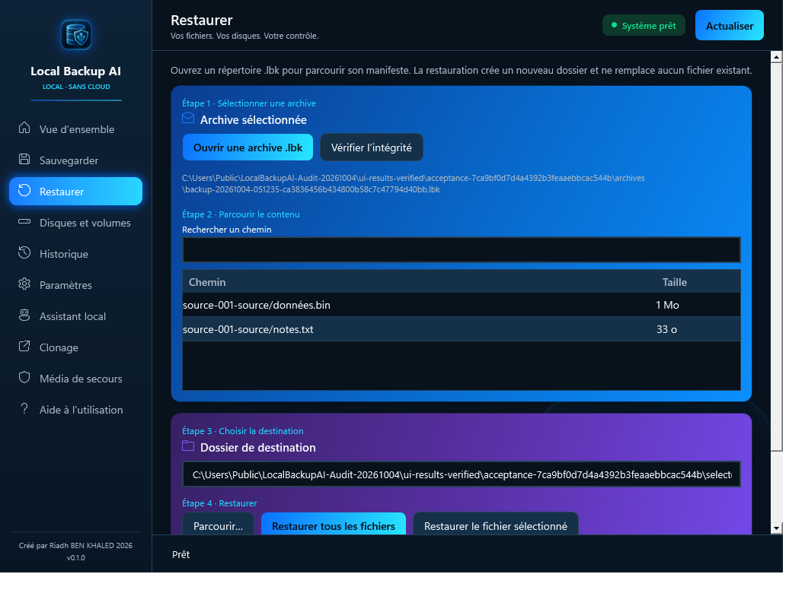

# Validation — 2026-10-04

[English README](README.md) · [Présentation française](README.fr.md) · [Machine-readable results](validation/2026-10-04.json)

These are project-maintainer test results, not an independent certification or a guarantee against data loss. Source-level tests and installed-product checks are reported separately.

## Published installer tested

- Release: **v0.1.0**, `LocalBackupAI-Setup.msi`, 66,519,559 bytes.
- SHA-256: `518ddb827f02a87c1117c3f280d7f2d2ec5589ef98bc3065adb730c1d5f5ce7c`.
- The tested local MSI matches the digest published for the GitHub release.
- Digital signature: **not signed**.
- VM: Windows 11 Pro x64, build **22000**, French locale, VMware virtual NVMe disk.
- The application and .NET were not installed before this test. Silent MSI installation returned **0**; no separate .NET installation was needed.
- Normal startup was also checked in the already logged-on Windows desktop: the **Local Backup AI** main window was observed and responsive. The test closed its process and removed its temporary launch task afterward. A prior WinRM-only startup probe could not observe a desktop window and was therefore inconclusive.

## Installed-product checks in the VM

The recovery executable came from the MSI installation. All eight checks returned their expected result:

| Check | Result |
|---|---|
| Back up generated sample files | Passed |
| Verify the resulting archive | Passed |
| Read its manifest | Passed |
| Restore into a new directory | Passed; source and restored SHA-256 match |
| Restore again to the existing destination | Rejected; existing files unchanged |
| Verify a deliberately corrupted copy of the archive | Rejected |
| Restore that corrupted copy | Rejected |
| Read-only disk inventory | Passed |

The dataset contains a Unicode filename, an empty file, an empty directory and a nested random binary file of **10,485,797 bytes**. Detailed hashes and exit codes are in the JSON report. All corruption tests use disposable copies created for this audit.

The WPF command/rendering harness also passed in the VM with exit code **0**, using a copy of the installed application's assemblies; **17 application DLLs were checked against the installed hashes**. It exercised real file backup, verification, complete and selective restoration, VHD/VHDX file copies with hash verification, and history/navigation. It produced nine page renders and two additional physical-cloning views.

VSS, physical disk/partition writes and Ollama were **simulated** in that harness. Their confirmation and error flows were exercised; this is not evidence of successful real snapshots, physical cloning or model inference. WPF command/rendering checks ran through WinRM and are not a manual mouse/keyboard usability test.

## Development-host checks

- Release build: passed, zero compiler warnings or errors in the recorded build.
- Solution test suite: **207 passed**, zero failures.
- Additional long-path test project: **9 passed**, zero failures.
- WPF command/rendering harness: passed with generated sample data.

The first restricted-sandbox run could not access some Windows virtual-disk and inventory APIs. The same solution tests passed outside that sandbox. A first VM harness launcher did not capture a native exit code; the harness was rerun with corrected process tracking and returned 0. Neither required a change to application behavior.

The 216 automated source tests do not mean 216 installer tests. The application source and these source-level test suites are not published in this distribution-only repository.

## Not established by this audit

This run did not validate Windows 10, real VSS snapshots, physical disk or partition writes, a live Ollama model, a newly built/booted WinPE ISO, power loss, hardware failure, or exhaustive DPI/accessibility behavior. No claim of production certification or complete system recovery follows from these results.

The installer remains unsigned. Scheduling and encryption are not available. The application interface remains French.

## Résumé français

Le MSI publié a été installé dans une VM Windows 11 sans application ni .NET préinstallés. Sauvegarde, vérification et restauration des fichiers de démonstration réussissent ; les SHA-256 correspondent. Les fichiers/dossiers vides et le nom Unicode sont conservés. L'écrasement d'une destination existante et une copie d'archive corrompue sont refusés.

Le lancement normal dans le bureau Windows ouvert a également été vérifié : fenêtre « Local Backup AI » présente et réactive, puis fermée par le test.

Le test WPF utilise les composants réellement installés, contrôlés par empreintes, et réussit avec le code de sortie 0. Les copies VHD/VHDX et les restaurations sont réelles ; VSS, les écritures sur disques physiques et Ollama sont simulés. Il ne remplace pas une validation manuelle complète de l'interface.

Les **207 + 9 tests** concernent le code sur le poste de développement. Les contrôles en VM sont détaillés séparément ci-dessus. L'absence de signature de l'installeur et les limites non testées sont explicitement conservées dans ce bilan.
